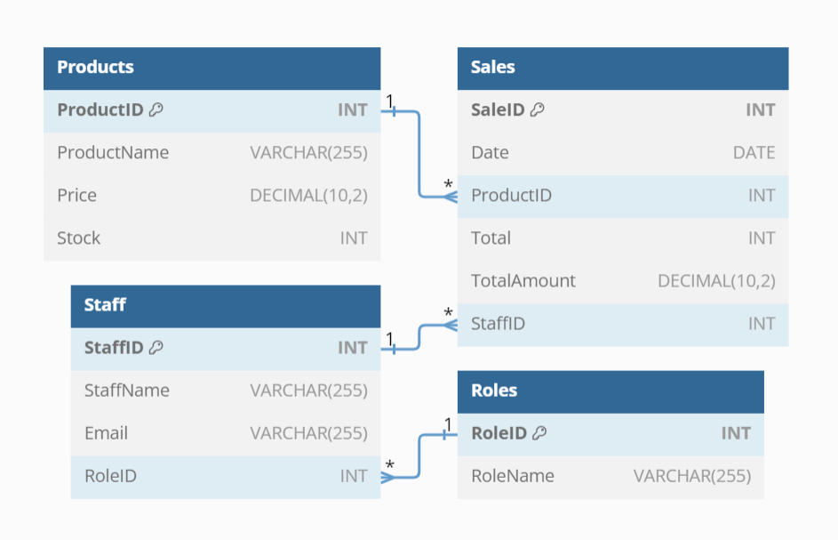
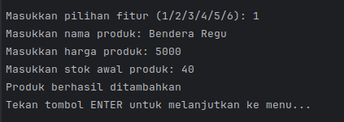
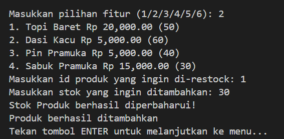
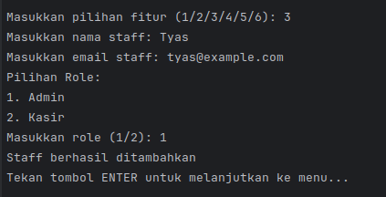
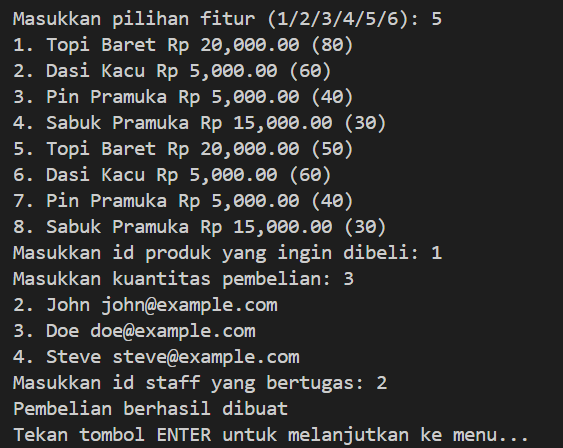
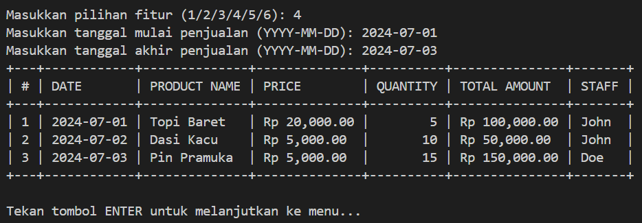
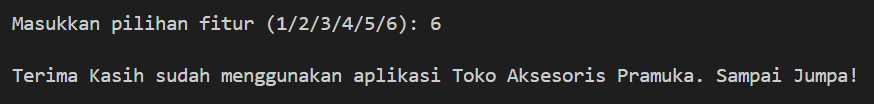

# Scout Store Admin CLI

## Project Description
Command Line Interface (CLI) application for store management that sells scout accessories using Golang and MySQL database. This application will facilitate users in managing important aspects of a store such as restocking product, adding staff, and sales reports.

## Application Features
1. **Add Product**
   - Allows staff to add new products to the database.
   - Staff will be required to enter the product name, price, and initial stock quantity.

2. **Restock Product**
   - Allows staff to add product stock to the database.
   - Staff will be asked to enter the stock of the product to be restocked.

3. **Make Purchase**
   - Allows staff to enter sold products and the system will reduce the initial stock of the product.
   - Staff can enter sold products and the system will reduce the initial stock of the product.

4. **Add Staff**
   - Allows users to add new staff.
   - The user will be asked to enter the name, email, and position of the staff to be added.

5. **Sales Report**
   - Displays sales reports based on a certain period.
   - Users can select a time period to view total sales, number of products sold, and total revenue.

6. **Exit**
   - Exit the application. Ends the CLI application usage session.

## Technology Used
- **Golang:** For CLI application development.
- **MySQL:** For database management.

## How to Run
- Clone this repository
- Add `.env` file with access to the database
- Create the database with the DDL and DML provided in the migrations folder
- Run `go run main.go`

## Database Schema
- **Products:** `ProductID`, `ProductName`, `Price`, `Stock`
- **Staff:** `StaffID`, `StaffName`, `RoleID`
- **Roles:** `RoleID`, `RoleName`
- **Sales:** `SaleID`, `Date`, `ProductID`, `Total`, `TotalAmount`, `StaffID`

## ERD

## Preview Scout Store Admin CLI
### Main Menu

### Add Product

### Add Staff

### Add Sales

### Sales Report

### Exit Menu

## Division of Tasks
- **Driver ([Ahmad Luhur Pakerti](https://github.com/00shiki)):** Writing menu display feature code
- **Navigator ([Mahattir Onassis]()):** Reviewing code and providing feedback
- **Observer ([Ghassani Tyas](https://github.com/ghssni)):** Taking notes and documenting features
